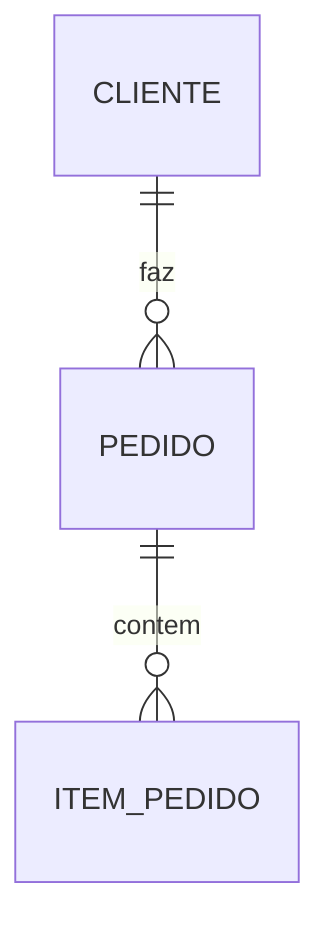

# Guia de análise SQL (legado)

Use na fase 3 da skill `legacy-discovery`. Objetivo: modelo as-is e regras sustentadas por objetos de banco.

## Fontes aceitas

- Dumps DDL (`.sql`)
- Scripts de migration
- Schemas exportados
- Procedures/functions/triggers em scripts
- Documentação de banco só como apoio (sempre validar no DDL)

Se só houver banco vivo sem scripts, peça export DDL ao usuário antes de afirmar o modelo completo.

## Ordem de leitura

1. `CREATE TABLE` / tipos / nullability  
2. PKs, FKs, UNIQUE, CHECK  
3. Índices (pistas de consultas frequentes)  
4. Views  
5. Triggers  
6. Stored procedures e functions  
7. Seeds / dados de domínio (quando existirem nos scripts)

## O que extrair por tabela

| Aspecto | Pergunta | Para onde vai |
|---------|----------|---------------|
| Nome | Entidade de negócio? | `data-model-as-is.md` |
| PK | Identidade | modelo |
| FKs | Relacionamentos | modelo |
| NOT NULL / DEFAULT | Obrigatoriedade | regras candidatas |
| CHECK / UNIQUE | Regra formal | `business-rules.md` |
| Colunas status/tipo | Máquina de estados | regras + glossário |
| Datas / auditoria | Trilha temporal | glossário |

## Inferência de regras (cuidado)

**Pode afirmar como regra** quando houver:

- CHECK, UNIQUE, FK com ON DELETE/UPDATE explícito
- Trigger que valida ou propaga estado
- Procedure cujo corpo implementa política clara

**Marcar como hipótese / lacuna** quando:

- Só o nome da coluna sugere significado
- Comentário SQL vago
- Lógica só no código da aplicação (cruzar depois)

Formato sugerido na regra:

`BR-xxx | descrição | fonte: dbo.Tabela / CK_Nome / TR_Nome`

## Procedures e functions

Para cada objeto relevante:

1. Nome e parâmetros  
2. Tabelas lidas/escritas  
3. Validações e ramos de decisão  
4. Evidência de chamada no código (fase 4)

Evite reescrever o SQL inteiro nos artefatos — resuma o comportamento e cite o objeto.

## Triggers

Classificar:

- Auditoria / histórico  
- Validação de negócio  
- Denormalização / cache  
- Cascata customizada  

Triggers de validação → candidatos fortes a `business-rules.md`.

## Views

Documentar views que:

- Encapsulam relatório ou regra de junção  
- São usadas pela UI/API como “entidade”

## Diagramação

No `data-model-as-is.md`, priorize:

- Entidades principais (não listar toda tabela auxiliar sem contexto)
- Relacionamentos com cardinalidade inferida das FKs
- Glossário só de colunas críticas

Mermaid ER opcional para subconjuntos críticos:

## Segurança

- Não incluir senhas, connection strings completas ou dados pessoais de dumps
- Se o dump tiver DML com PII, ignore valores e documente só a estrutura

## Cruzamento com código

Após o SQL:

- Confirmar quais tabelas/procs a aplicação realmente usa  
- Marcar objetos órfãos (só no banco, sem referência no código) como possível dívida
