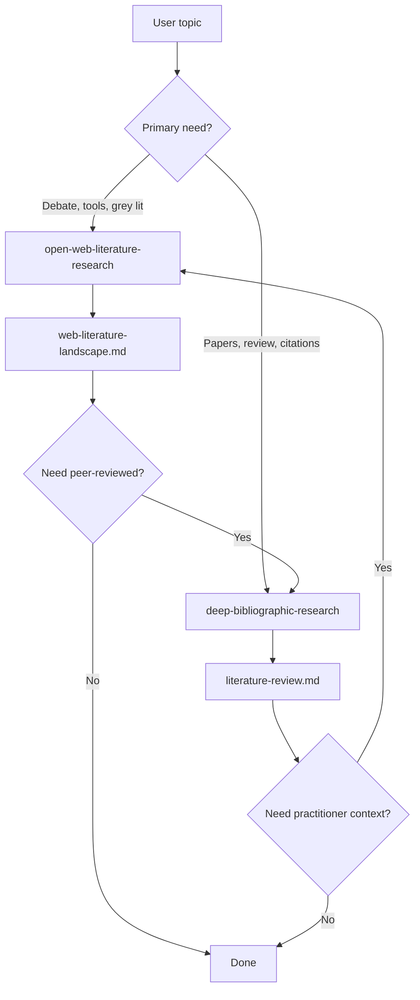

# Handoff to Academic Bibliographic Research

When open-web mapping is insufficient, escalate to [`deep-bibliographic-research`](../../deep-bibliographic-research/SKILL.md) (sibling skill) or ask the user to activate it.

---

## When to Hand Off

| User signal | Action |
|-------------|--------|
| "Preciso citar em artigo / tese / grant" | Hand off for peer-reviewed sources |
| "Quero os papers fundacionais" | Hand off — web skill does not query Scholar/OpenAlex/arXiv |
| "Systematic review" / "PRISMA" | Hand off — out of scope here |
| "Meta-análise" / effect sizes from literature | Hand off |
| User names Scholar, arXiv, OpenAlex, Semantic Scholar, DBLP, ACL Anthology | Switch skills immediately |
| Web map shows debate but no empirical anchor | Suggest handoff after delivering web report |

**Do not** "just quickly check Scholar" while in this skill — boundary keeps workflows clean.

---

## When to Stay in Open-Web Skill

| User signal | Action |
|-------------|--------|
| "O que a comunidade está dizendo?" | Stay |
| "Blogs e newsletters sobre X" | Stay |
| "Como implementar / qual ferramenta usar?" | Stay (docs + blogs) |
| "Panorama informal" / "literatura cinzenta" | Stay |
| "Preparar aula ou post" | Stay (note verification limits) |

---

## Context Package for Handoff

Pass these artifacts to the academic skill briefing (copy into chat or file):

### 1. Refined research question

From web work, sharpen:

- **Primary question** (one sentence)
- **Subquestions** discovered on the web
- **Constructs** and preferred terminology (academic vs. industry terms)

### 2. Concept table

Export from `search-strategies.md` work:

- Synonyms, abbreviations, key authors/labs named on the web
- Anti-terms that polluted searches

### 3. Seed references (optional)

Tier A/B web sources often link to DOIs or arXiv IDs. List them as **candidate seeds** for snowballing in `deep-bibliographic-research` — do not fetch metadata here if handoff is immediate.

### 4. Coverage gaps

Explicit list for academic search:

- Topics discussed only in blogs, never with papers linked
- Missing time periods
- Geographic or language bias from web corpus

### 5. Exclusion carryover

Reuse user exclusions where applicable (editorials, languages, date window).

---

## Suggested User Prompt (template)

Offer this when handing off:

```text
Ative deep-bibliographic-research com este contexto:

Tema: {topic}
Pergunta: {refined question}
Janela: {years}
Idiomas: {languages}

Termos descobertos na web: {synonym list}
Labs/autores mencionados: {names}
Lacunas a cobrir: {gaps}
Seeds (URLs/DOIs mencionados em blogs): {list}
```

---

## Reverse Handoff (academic → open web)

From `deep-bibliographic-research`, suggest **this skill** when the user needs:

- Practitioner discourse not visible in indexes
- Tooling / implementation landscape
- Policy or industry grey literature
- Tutorial and explainer layer for teaching

---

## Combined Workflow (recommended sequence)



---

## Skill Dependencies

| Skill | Relationship |
|-------|----------------|
| `research-literacy` | Exploratory vs. confirmatory framing (both skills) |
| `deep-bibliographic-research` | Academic index search, dedup, citation snowball |
| `paper-to-skill` | After academic skill identifies methods papers |

---

## Verification Reminder (both skills)

Open-web tiers ≠ peer review. Academic metadata ≠ truth. User verifies before publication.
